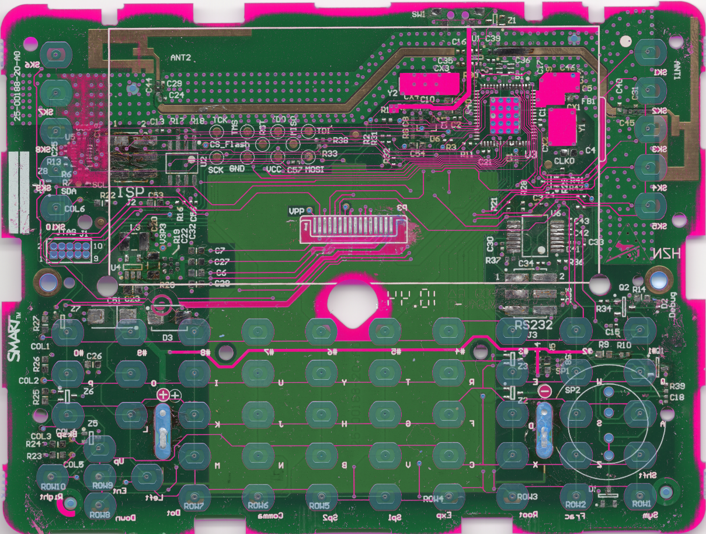

# SMART Response XE terminal schematic

Note: une version française est disponible plus bas dans la page

# Some comments
* As a lazy person, I first asked SMART Technologies if they can release the schematics to the DIY community. As they refused to make the schematics available, I did reverse engineering from an HD scan found on [Hackaday.io](https://hackaday.io/project/160664-smart-response-xe-reverse-engineering)
I also used one of the terminal I own.
* The schematic is not 100% accurate and there are probably some errors and/or missing parts
* Components which value is ending with a \* are not mounted
* The decoupling capacitors are not represented
* MAX3226 is a guess. I have looked at different RS232 transceivers and it is the one that matches best.
* There is one mystery components (U5) I was unable to discover what it is. It has an I²C interface and a digital I/O.

# What can easily be added
## LED
There is provision for an LED (identified as DEBUG on the PCB).

The LED is driven by PB0

One just needs to add 2 resistors (R34, R14), a NPN (Q2) and a LED.

Q2 can be a 2N2222

R34 a 4,7K resistor and R14 a 220 Ohms resistor

## BUZZER
There is also provision for a buzzer.

The buzzer is driven by PE3

The schematic seems somewhat convoluted but it allows several configurations.
### Direct drive with I/O
Mounting R39 0 Ohm, a small piezo buzzer and R10 100 Ohms you have the cheaper version. R10 can be modified to get a more or less loud sound 
### Transistor buffered and speaker
Mounting Q1 and R9 you can use a small speaker.

----

# Quelques remarques
* Comme je suis un peu flemmard, j\'ai d\'abord demandé à SMART Technologies s\'il pouvait donner les schéma à la communauté DIY. Comme ils ont refusé, j\'ai refait les schémas à partir d\'un scan HD trouvé sur [Hackaday.io](https://hackaday.io/project/160664-smart-response-xe-reverse-engineering)
J\'ai aussi utilisé l\'un des terminaux que je possède.
* Les schémas ne sont pas fidèles à 100% et il y a probablement des erreurs ou omissions
* Les composant dont la référence se termine par \* sont non montés
* Les condensateurs de découplage ne sont pas représentés
* Le MAX3226 est une supposition. J'ai regardé plusieurs interfaces RS232 et c'est celui qui correspondait le mieux.
* Il reste un composant mystère (U5) je n\'ai pas trouvé ce que c\'est. il a un bus I²C est une interface digitale.

# Ce que l\'on peut facilement ajouter
## LED
Il y a une zone prévu pour monter une LED (identifié par DEBUG sur le circuit imprimé).

La LED est pilotées par la sortie PB0

Il suffit d\'ajouter 2 résistances, un transistor NPN et une LED.

Q2 peut être un 2N2222

R34 une résistance de 4,7K  and R14 une résistance de 220 Ohms.

## BUZZER
Il y a aussi un emplacement prévue pour monter un buzzer.

Le buzzer est piloté par la sortie PE3

Le schéma semble un peu tordu mais il permet plusieurs configurations.
### Pilotage direct par un I/O
On monte R39 0 Ohm, un petit buzzer piezo et R10 100 Ohms pour la version économique. La valeur de R10 peut être modifiée pour adapter le niveau sonore.
### Transistor + haut-parleur
En montant Q1 et R9, on peut utiliser un petit haut-parleur.

