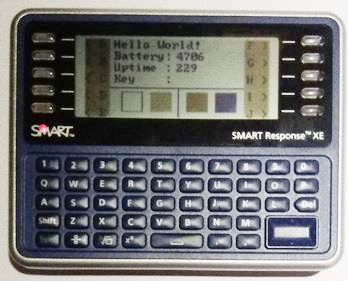
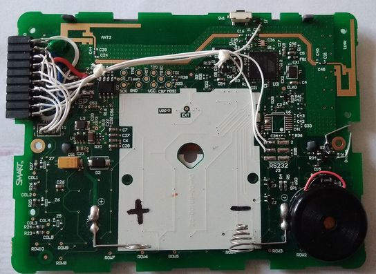
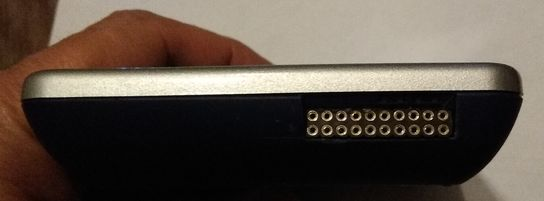
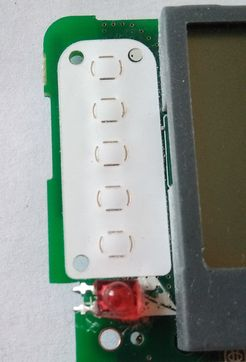
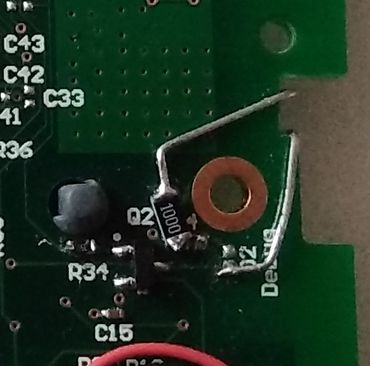
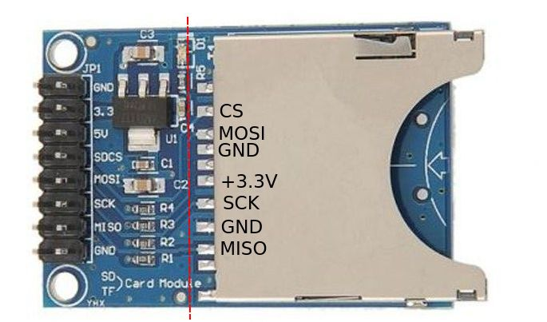
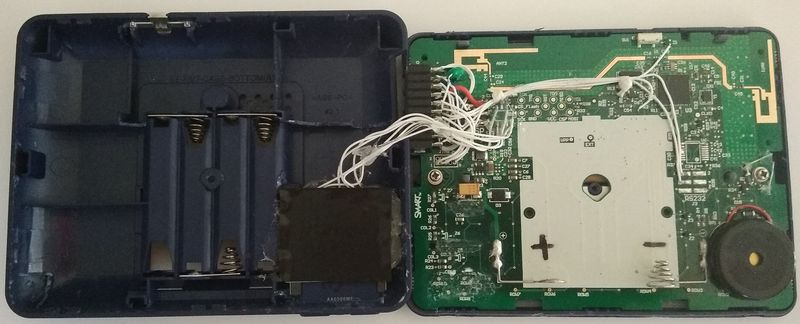
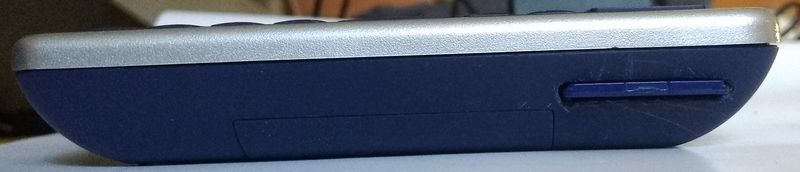

# Hacks

Note: une version française est disponible plus bas dans la page

 

## Extension connector Hack
This hack adds an extension connector to the terminal. The connector exposes the two serial port, the ISP, the I2C bus, the JTAG port.

* Serial0 is wired so that an FTDI cable can be directly plugged in.
* The ISP is also the SPI bus so it can be both used for programming and for connecting external components.
* The JTAG port is not usually used but the 4 pins can also be used as digital or analogue port. If JTAG is deactivated (in the fuses).

## Buzzer
As seen on the schematic, there is provision for a buzzer. I have choosed to drive the buzzer with the I/O without a transistor.

## LED
There is also provision for an LED. I have added a transistor and 2 resistors.

In order to make it easy to use, the LED can be installed on the front side of the PCB with its connexions folded on the back side. Doing this, the LED is part of the PCB but can be still be exposed through a small hole on the front cover. The case is drilled but not the plastic of the front face which is only scraped to make it transparent. The LED appears just above the SMART logo on the left side of the frontside.

  
## SD card

One can add an SD card to the terminal. It can be interesting if the flash already in the terminal is to small or it has been programmed too many time.

I choose to unsolder the flash memory and connected the card instead. The connection are really simple.

| Flash | SD card reader |
| ----- | -------------- |
| 1     | CS             |
| 2     | MISO           |
| 3     | no connection  |
| 4     | GND            |
| 5     | MOSI           |
| 6     | SCK            |
| 7     | no connection  |
| 8     | +3.3V          |

In order to put the card reader inside the terminal and as  the electronic of the terminal works on 3.3V, I took a card reader that I trimmed a little.

I cut the card reader at the red line on the picture

A opening was made on one side of the terminal and the card reader hot-glued in place. A black tape is added for insulation as the card reader touches the + connection on the main board.

There is no modification to the library as there are currently many libraries that manage SD card in the Arduino world

## Connecteur d\'extension

Ce montage permet d\'ajouter un connecteur d\'extension qui expose les deux ports série, le connecteur ISP, le bus I2C et le port JTAG.

* Le port serie 0 et câblé de telle sorte que l\'on puisse y connecter directement un câble FTDI.
* Le port ISP est aussi le port SPI il peut donc être utilisé soit pour programmer le CPU, soit pour connecter des composants externes.
* Le port JTAG n\'est pas couramment utilisé mais ses 4 broches peuvent aussi être utilisées comme broches digitales ou analogiques. Si le port JTAG est désactivé (par les fusibles)

## Buzzer
Comme vu dans le schéma, il y a la place pour ajouter un buzzer. J\'ai choisi de le piloter directment sans transistor.

## LED
Il y a aussi de prévu un circuit pour raccorder une LED. J\'ai ajouté un transistor et 2 résistances pour cela.

  

Pour en faciliter l\'usage, la LED peut être monter sur la face avant avec ses broches repliées vers l\'arrière. En faisant ça, la LED est montée sur le circuit imprimé mais elle reste visible par l\'avant par un petit trou réalisé dans la face avant. Le boitier est percé mais non le plastique de la façade qui est seulement gratté pour le rendre transparent. La LED apparait juste au-dessus du logo SMART sur la gauche de la face avant.

## SD card

On peut ajouter un lecteur de carte SD au terminal. Il peut être intéressant d'ajouter un lecteur de carte SD si la flash du terminal est trop petite ou si elle a été programmée de trop nombreuses fois

J'ai fait le choix de dessouder la flash interne pour y connecter le lecteur de carte à la place. Le raccordement est simple.

| Flash | SD card reader   |
| ----- | ---------------- |
| 1     | CS               |
| 2     | MISO             |
| 3     | pas de connexion |
| 4     | GND              |
| 5     | MOSI             |
| 6     | SCK              |
| 7     | pas de connexion |
| 8     | +3.3V            |

Pour faire rentrer le lecteur de carte dans le terminal et comme l'électronique du terminal est en 3,3V, J'ai pris un lecteur de carte du commerce que j'ai adapté un peu.

J'ai coupé la carte au niveau du trait rouge.

Une ouverture a été ménagée sur un côté du boîtier et le lecteur de carte collé en place avec de la colle chaude. Un scotch isolant a été ajouté car le dos du lecteur de carte touche la borne + de la carte principale.

Il n'y a aucune modification de la librairie car il existe déjà plusieurs librairies de gestion de carte SD dans le monde Arduino